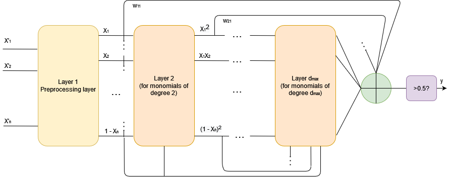

# DIPNN: Deep Interpretable Polynomial Neural Network

  **[Overview](#overview)**
| **[Usage](#usage)**

## Overview

The repository contains an implementation of DIPNN (Deep Interpretable Neural Network), a new neural network architecture and training algorithm for generating interpretable models. 

The algorithm is derived using a learning bound for predictors that are convex combinations of functions from simpler classes. More explicitly, the hypothesis are polynomials over the input features, and are interpreted as convex combinations of (simpler) homogeneous polynomials. Training is done by minimizing a surrogate of the learning bound, using an iterative two-phases algorithm. Basically, in the first phase the algorithm decide which new monomials of higher degree should be added, and in the second phase the coefficients are recomputed by solving a convex program. The interpretability is achieved by transforming the input features such that they can be viewed as reflecting the degree of truth of some proposition about the instance that is being classified. In this paradigm, the trained neural network will be a compound proposition and it can be understood by humans.



## Usage

-Clone the repository
-Install the dependences
```bash
$ pip install -r .\requirements.txt
```
-Import and use the module

```python
from DeepInterpretablePolynomialNeuralNetwork.src.deep_interpretable_polynomial_neural_network import DeepInterpretablePolynomialNeuralNetwork, GrowthPolicy
from sklearn.model_selection import train_test_split

# Data
path = './data/my_data.csv'
X, Y = read_data(path)

# Model
ro = 1.0
fixed_margin = False
growth_policy = GrowthPolicy.GROW
balance = 1.0
lambda_param = 0.1
d_max = 2
max_no_terms_per_iteration = 500
max_no_terms = 1000
derivative_magnitude_th = 0.0
dipnn = DeepInterpretablePolynomialNeuralNetwork(d_max=d_max, lambda_param=lambda_param, balance=balance, fixed_margin=fixed_margin, ro=ro, derivative_magnitude_th=derivative_magnitude_th, coeff_magnitude_th=0.0, max_no_terms_per_iteration=max_no_terms_per_iteration, max_no_terms=max_no_terms, growth_policy=growth_policy)

# Train
X_train, X_test, Y_train, Y_test = train_test_split(X, Y, test_size=test_size)
dipnn.train(X_train,Y_train)

# Predict
Y_predicted_binary, Y_predicted = dipnn.predict(X_test)
```

The algorithm was tested with Python 3.9. 
